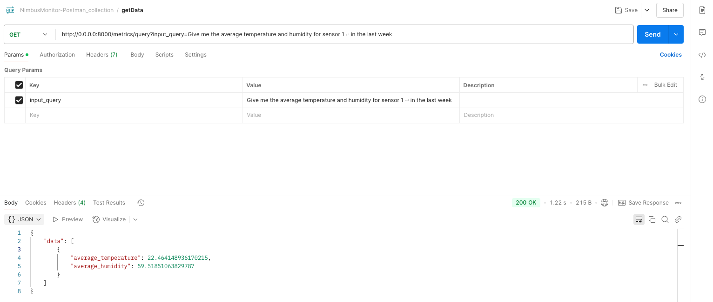
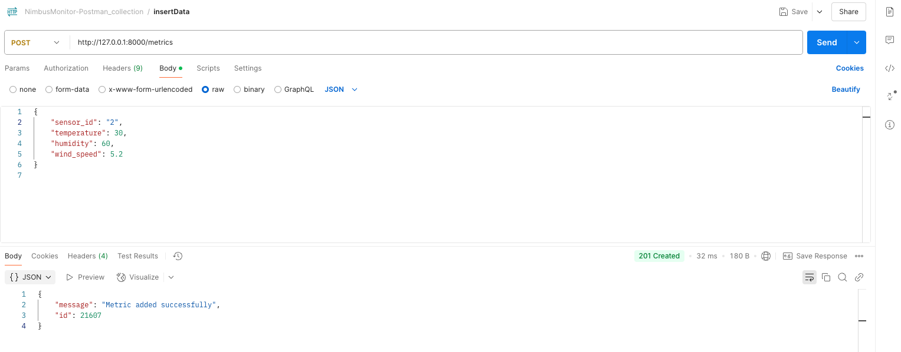

# Nimbus Monitor

This project lets you query the data from the database using natural language
query as an input.

## Features
- Natural Language Processing: The application uses OpenAI's GPT-4o model to process natural language queries and convert them into SQL queries which runs on the sqlite database
- SQLite Database: The application uses SQLite as the database to store and retrieve data. In this, the data is store from 2025-01-01 to 2025-03-31 (YEAR-MONTH-DAY) around 21605 records are present with 5 sensors
- fastapi : The application uses fastapi to create a RESTful API for the application. It provides endpoints to query the data and get the results in JSON format.
- PyDantic: It is used to validate the input data and ensure that it is in the correct format before processing it. Also, used as a data bean class to store & access the data
- pytest: The application uses pytest to run the tests and ensure that the application is working correctly. It provides a test suite to test the application and ensure that it is working as expected.
- SQlAlchemy: The application uses SQLAlchemy to interact with the SQLite database. It provides an ORM (Object Relational Mapping) to interact with the database and perform CRUD operations. This also gives the bandwidth to switch to any other database in the future.


## Installation
Python 3.10.12 above is required to run the code.

Create a virtual environment using the following commands:

```bash
python -m venv .venv
source .venv/bin/activate
```

Install the required packages using the following command:
```bash
pip install -r requirements.txt
```

run the following command to run the tests:
make sure everything is working properly and the tests are passing.
```bash
pytest
```

Important test case is where you have defined the openai Keys

to run the api service you need to run the following command:
```bash
fastapi run main.py
```

this will start the local server on port 8000
and you can access the API at `http://localhost:8000/docs` to see the available endpoints and test them.

Postman Collection is also included in the repo to test the endpoints.
```
postman-collection -> PostmanCollection.json
```

get the data from the database using the following command:
- input_query : whats the max temperature of sensor 1? 
```bash
curl --location 'http://0.0.0.0:8000/metrics/query?input_query=whats%20the%20max%20temperature%20of%20sensor%201%3F%20'
```

To insert the data into the database using the following command:
```bash
curl --location 'http://127.0.0.1:8000/metrics' \
--header 'Content-Type: application/json' \
--data '{
    "sensor_id": 2,
    "temperature": 30,
    "humidity": 60,
    "wind_speed": 5.2
}
'
```

## Postman ScreenShots






## Enhancements
- The application can be enhanced to support more complex queries and provide more advanced features
- Implementation of a caching mechanism to improve performance
- More focus on LLM based query generation and trusting LLM generated queries to run directly on the database
- Scope and margin to implement Guardrails
